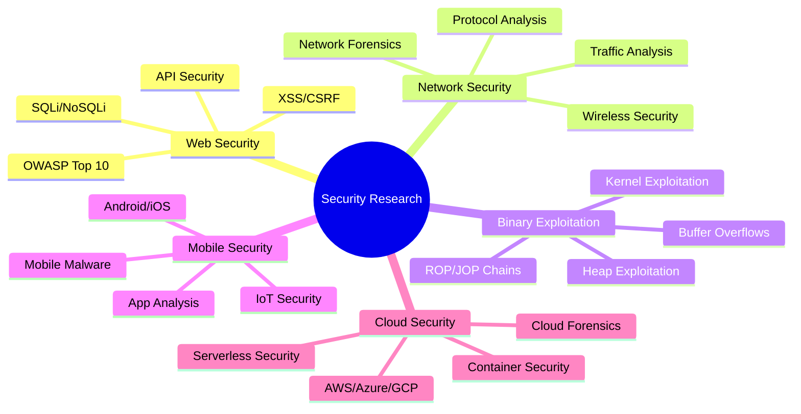

# 🔴 HackTeam.Red

<div align="center">


[](#-join-us)

*Ethical Hacking • Cybersecurity Research • Red Team Operations*

</div>

---

## 🎯 **About Us**

**HackTeam.Red** is a collaborative cybersecurity research organization dedicated to advancing information security through ethical hacking, vulnerability research, and red team operations. We operate under strict ethical guidelines and focus on making the digital world safer for everyone.

### 🏆 **What We Do**

- **🔍 Vulnerability Research** — Discovering and responsibly disclosing security flaws
- **🎭 Red Team Operations** — Simulating advanced persistent threats for defense improvement  
- **🛠️ Security Tool Development** — Creating open-source security tools and frameworks
- **📚 Security Education** — Sharing knowledge through workshops, articles, and training
- **🤝 Community Engagement** — Contributing to the global cybersecurity community

---

### **Research Areas**



---

## 📊 **Statistics**

<div align="center">


</div>

### **2025 Achievements**

- 🥇 **15+ Organisation Top 10 Tentest Finishes**
- 🐛 **7+ CVEs Discovered**
- 🛡️ **27+ Security Tools Released**
- 📚 **6+ Research Papers Published**
- 👥 **600+ Community Members**

---

## 🌟 **Featured Projects**

### 🔥 **Artaxerxes**
> Artaxerxes - Adaptive High-Performance Stress Tester v.1.0. Rebuild old version Xerxes DDoS. Supports GPU+io_uring, DPDK, eBPF/XDP with intelligent fallbacks. Educational tool for advanced cybersecurity labs.

### 🕷️ **indulgentia**
> OSINT Subdomain Finder in Certificate Transparency.

### 🏴‍☠️ **vacuum_and_masquerade**
> DNS - Server Amplification Scanner and Masker - Advanced Penetration Testing Framework.

---

## 👥 **Team Structure**

### **Core Team**

| Role | Member | Expertise | Contact |
|------|---------|-----------|---------|
| 🎯 **Team Lead** | [@toxy4ny](https://github.com/toxy4ny) | Strategic Operations | 📧 b0x@hackteam.red |
| 🔬 **Research Lead** | [@zzl0y](https://github.com/zzl0y) | 0-day Research | 📧 b0x@hackteam.red |
| ⚔️ **Junior Pentester** | [@V3kt0r39](https://github.com/V3kt0r39) | APT Simulation | 📧 b0x@hackteam.red |

### **Specialization Teams**

- 🌐 **Web Security Division** → Advanced web application testing
- 📱 **Mobile Security Unit** → iOS/Android security research  
- ☁️ **Cloud Security Team** → Multi-cloud security assessment
- 🔧 **Exploit Development** → 0-day research and weaponization
- 🏆 **VX Competition Squad** → Professional VX team
- 💥 **AD Penetration Technique** → Windows and Active Directory pentesting
---

## 🚀 **Join Us**

### **We're Looking For**

- **Security Researchers** with 0-day hunting experience
- **Penetration Testers** specializing in enterprise environments
- **Malware Analysts** with reverse engineering skills
- **DevSecOps Engineers** for security automation

### **Requirements**

- ✅ Strong ethical foundation and responsible disclosure mindset
- ✅ Demonstrable cybersecurity skills and experience
- ✅ Ability to work collaboratively in distributed teams
- ✅ Commitment to knowledge sharing and community building
- ✅ Clean background check for sensitive research projects

### **How to Apply**

1. **📋 Submit Application** → [Join Form](mailto:b0x@hackteam.red)
2. **🧪 Technical Challenge** → Complete our security assessment
3. **💬 Team Interview** → Discussion with core team members
4. **🤝 Probation Period** → 3-month evaluation period

---

### **Community**

- 💬 [**Matrix Server**](#r00m:undead.moscow) — Real-time team communication
- 📱 [**Dev.to News**](https://dev.to/toxy4ny/) — Security news and updates  
- 🐦 [**DefCon Social**](https://zpj4sjt4a5ah53s34utu2xhs7owdmgknc3xzvv6chpiodw5rdknkzbid.onion/@toxy4ny) — Public announcements

---

## ⚖️ **Ethics & Legal**

### **Our Principles**

```yaml
Code of Conduct:
  - Responsible Disclosure: "Always report vulnerabilities to vendors first"
  - Legal Compliance: "Operate within legal boundaries in all jurisdictions"
  - Educational Focus: "Share knowledge to improve global security posture"
  - No Malicious Activity: "Never engage in illegal or harmful activities"
  - Respect Privacy: "Protect personal data and respect user privacy"
```

### **Vulnerability Disclosure**

We follow **coordinated vulnerability disclosure** practices:

- 🔒 **Private reporting** to affected vendors
- ⏰ **90-day disclosure timeline** (extendable for complex fixes)
- 🤝 **Collaboration** with vendors for effective remediation
- 📢 **Public disclosure** only after vendor approval or timeline expiration

---

## 📞 **Contact**

<div align="center">

### **Get in Touch**

📧 **General Inquiries**: [contact@hackteam.red](mailto:b0x@hackteam.red)  
🐛 **Security Issues**: [security@hackteam.red](mailto:b0x@hackteam.red)  
🤝 **Partnerships**: [partners@hackteam.red](mailto:b0x@hackteam.red)  
📰 **Media**: [media@hackteam.red](mailto:b0x@hackteam.red)

---

### **Social Media**

[](https://github.com/hackteam-red)

---

**⭐ Star our repositories if you find them useful!**

*"Making the digital world safer, one vulnerability at a time."*

</div>

---

<div align="center">


**© 2025 HackTeam.Red — All Rights Reserved**

</div>
